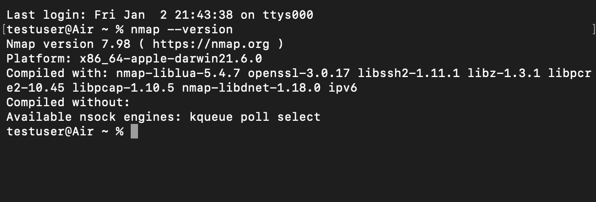

# FUTURE_CS_03
# Cyber Security Internship – Task 3

## Task Title
Network Scanning & Vulnerability Assessment

## Objective
To perform network scanning using Nmap to identify open ports, running services, and potential security risks.

## Tools Used
- Nmap
- Localhost / Local Network

## Contents
- scans/ – Nmap scan outputs
- reports/ – Vulnerability assessment report
- screenshots/ – Proof of scans

## Skills Covered
- Network reconnaissance
- Port scanning
- Service enumeration
- Vulnerability identification
 
## Tool Verification

Nmap was successfully installed and verified using the following command:

`nmap --version`

Screenshot proof is available below:

